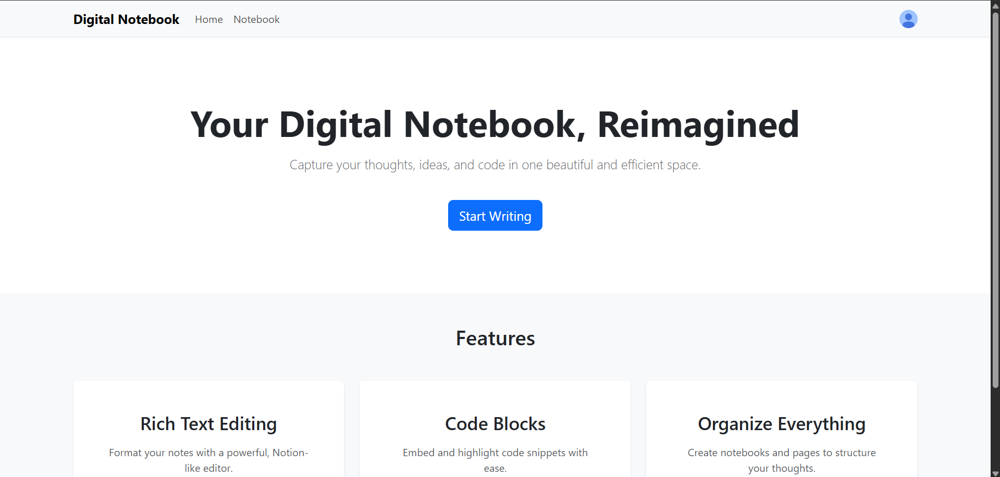

# Digital Notebook

Digital Notebook is a personal application designed for organizing thoughts, notes, and ideas. It provides a streamlined interface for users to create and manage notebooks, chapters, and individual pages, facilitating an efficient workflow for content creation and knowledge management.

## Live Demo

[Link to your live application](https://digital-notebook-59e2.onrender.com)

## Screenshots

_(Add screenshots of your application here)_


## Features

- **User Authentication:** Secure sign-up and sign-in processes powered by Clerk.
- **Notebook Management:** Create, view, update, and delete personal notebooks.
- **Chapter Organization:** Structure your notebooks by creating, viewing, updating, and deleting chapters within them.
- **Page Creation:** Add, view, update, and delete individual pages within chapters.
- **Rich Text Editing:** Utilize a powerful rich text editor (Tiptap) for comprehensive page content.
- **Responsive Design:** A user-friendly interface that adapts to various screen sizes.

## Technologies Used

### Frontend

- **React.js:** A JavaScript library for building user interfaces.
- **Vite:** A fast build tool for modern web projects.
- **React Router DOM:** For declarative routing in React applications.
- **Axios:** A promise-based HTTP client for making API requests.
- **React Bootstrap:** A popular UI toolkit for React, providing pre-built components.
- **Tiptap:** A flexible and extensible rich text editor for web applications.

### Backend

- **Node.js:** A JavaScript runtime built on Chrome's V8 JavaScript engine.
- **Express.js:** A fast, unopinionated, minimalist web framework for Node.js.
- **MongoDB (Mongoose):** A NoSQL database and an ODM (Object Data Modeling) library for MongoDB and Node.js.
- **Dotenv:** To load environment variables from a `.env` file.
- **Nodemon:** A utility that monitors for any changes in your source and automatically restarts your server.

### Authentication

- **Clerk:** For robust and secure user authentication (both frontend and backend).

## Setup Instructions

Follow these steps to get your Digital Notebook project up and running locally.

### 1. Clone the Repository

```bash
git clone <repository_url> # Replace with your repository URL
cd digital_notebook
```

### 2. Frontend Setup

Navigate to the `frontend` directory and install the dependencies:

```bash
cd frontend
npm install
```

### 3. Backend Setup

Navigate to the `server` directory and install the dependencies:

```bash
cd ../server
npm install
```

### 4. Environment Variables

Create `.env` files in both the `frontend` and `server` directories and populate them with your respective keys.

#### Frontend (`frontend/.env`)

Create a `.env` file in the `frontend` directory and add your Clerk Publishable Key:

```
VITE_CLERK_PUBLISHABLE_KEY=your_clerk_publishable_key
```

#### Backend (`server/.env`)

Create a `.env` file in the `server` directory and add your MongoDB connection string and Clerk Secret Key:

```
MONGO_URI=your_mongodb_connection_string
PORT=5000
CLERK_SECRET_KEY=your_clerk_secret_key
```

## Usage

To run the application, you need to start both the backend server and the frontend development server.

### 1. Start the Backend Server

From the `server` directory, run:

```bash
npm run start
```

### 2. Start the Frontend Development Server

From the `frontend` directory, run:

```bash
npm run dev
```

The application will be accessible in your web browser at `http://localhost:5173`.

## Contributing

Contributions are welcome! If you have any suggestions or find any bugs, please feel free to open an issue or submit a pull request.

## License

This project is licensed under the MIT License. See the [LICENSE](LICENSE) file for details.
